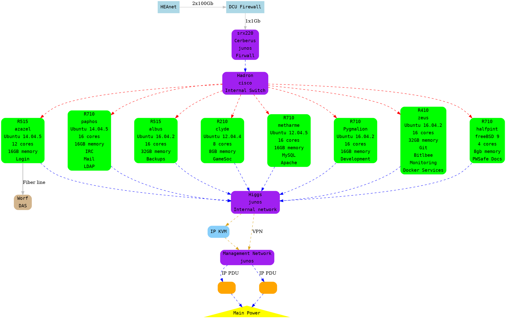

# Numbers

## 1->29 Boxs

| machine    | ip            | info                                                                  |
| ---        | :---:         | ---:                                                                  |
| carbon     | 136.206.15.1  |                                                                       |
| morpheus   | 136.206.15.2  |                                                                       |
| deathray   | 136.206.15.3  |                                                                       |
|            | 136.206.15.4  |                                                                       |
|            | 136.206.15.5  | this used to be ns.redbrick.dcu.ie                                    |
| lightning  | 136.206.15.6  |                                                                       |
| coke       | 136.206.15.7  |                                                                       |
| sprout     | 136.206.15.8  |                                                                       |
| thunder    | 136.206.15.9  |                                                                       |
|            | 136.206.15.10 |                                                                       |
| ceilingcat | 136.206.15.11 |                                                                       |
|            | 136.206.15.12 | this used to be obelisk                                               |
|            | 136.206.15.13 |                                                                       |
| murphy     | 136.206.15.14 |                                                                       |
| b4         | 136.206.15.15 |                                                                       |
| data       | 136.206.15.16 |                                                                       |
| (reserved) | 136.206.15.17 | b4-os.mgmt is on 192.168.1.17, so using this external address is iffy |
|            | 136.206.15.18 |                                                                       |
| boomer     | 136.206.15.19 |                                                                       |
|            | 136.206.15.20 |                                                                       |
| minerva    | 136.206.15.21 |                                                                       |
| severus    | 136.206.15.22 |                                                                       |
| cynic      | 136.206.15.23 |                                                                       |

## 30 -> 39

Reserved for future Service VMs.

## 40 -> 49 Other

| machine | ip            | info |
| ---     | :---:         | ---: |
| blinky  | 136.206.15.40 |      |
| clyde   | 136.206.15.41 |      |

## 50 -> 89 Primary Services

| service               | ip            | info                                                            |
| ---                   | :---:         | ---:                                                            |
| login                 | 136.206.15.50 | redbrick.dcu.ie also points here                                |
|                       | 136.206.15.51 | (was once used for news. news.rb is now a cname carbon.internal |
| irc                   | 136.206.15.52 |                                                                 |
| dns                   | 136.206.15.53 |                                                                 |
| bitlbee               | 136.206.15.31 |                                                                 |
| mailhost              | 136.206.15.55 |                                                                 |
| mailhost2             | 136.206.15.56 | not currently in use                                            |
| lists                 | 136.206.15.57 |                                                                 |
| imap                  | 136.206.15.58 |                                                                 |
| jakarta               | 136.206.15.59 |                                                                 |
|                       | 136.206.15.60 | old www                                                         |
| vhost                 | 136.206.15.61 |                                                                 |
| www                   | 136.206.15.70 |                                                                 |
|                       | 136.206.15.71 | allocated for some vhosts                                       |
|                       | 136.206.15.72 | was previously redbrick.dcu.ie                                  |
| tunnel                | 136.206.15.73 |                                                                 |
| qwebirc               | 136.206.15.74 |                                                                 |
| postgres              | 192.168.0.75  |                                                                 |
| mysql                 | 192.168.0.76  |                                                                 |
|                       | 136.206.15.7  | reserved, databases                                             |
|                       | 136.206.15.78 | reserved, databases                                             |
| twitter.internal      | 192.168.0.79  |                                                                 |
| radio.redbrick.dcu.ie | 136.206.15.80 |                                                                 |

## 90 -> 99 Secondary Services

Where possible, these should correspond to the primary service ip.

| service | ip            | info |
| ---     | :---:         | ---: |
| dns2    | 136.206.15.93 |      |

## 100 -> 199 DHCP Range

## 200 -> 209 Ceiling Cat VM range

Currently not in use.

## 210 -> 249 Currently Unused

This range will possibly be used in future for other VMs etc.

## 250 -> 254 Routing & Infrastructure

| machine         | ip             | info              |
| ---             | :---:          | ---:              |
| munger          | 136.206.15.250 | this is a printer |
| enzyme          | 136.206.15.251 |                   |
| hadron          | 136.206.15.252 |                   |
| electrode (UPS) | 192.168.1.253  |                   |

## Network diagram (2014)

Colours represent the networks each server is connected to.

- Red: External VLAN
- Blue: Internal VLAN
- Yellow: Management VLAN
- Green: RBVM Subnet crossover

