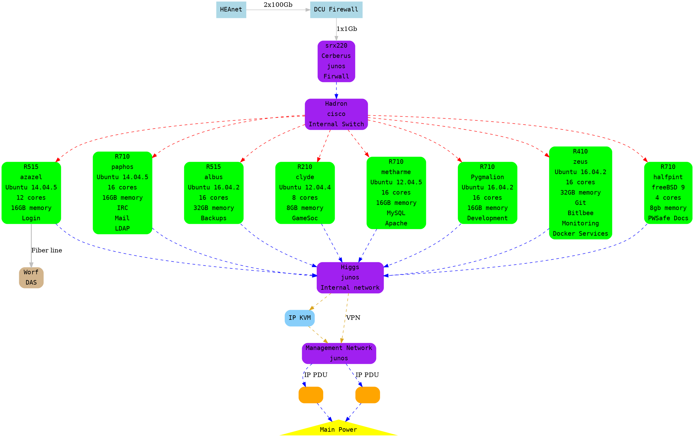

# Redbrick Network Setup

Redbrick's network comprises three VLANs all of which are present on Hadron.

The three VLANs are:

- Internal
- External
- Management

Other notible networks in Redbrick are:

- RBVM Subnet
- Severus VPN

## Internal VLAN

**Subnet:** 192.168.0.0/24

The internal network is used for internally hosted services that should not be
accessible from the outside. eg NFS, LDAP, MySQL etc.

Blue or grey cables are used when connecting a server to this network.

## External VLAN

**Subnet:** 136.206.15.0/24

The external network is used for publically hosted services eg. SSH, Webhosting,
DNS etc.

Red cables are used when connecting a server to this network.

The External VLAN spans the Redbrick server room and the library, allowing
Serverus to be mapped onto the External VLAN.

## Management VLAN

**Subnet:** 192.168.1.0/24

The management network is used solely for management cards. The only server
(non-management card) connected to this network is halfpint.

Yellow cables are used when connecting a server to this network.

## RBVM Subnet

**Subnet:** 136.206.16.0/24

The RBVM Subnet is a whole /24 used solely for user VMs provided by RBVM. The
RBVM subnet is firewalled by data.

A green cable is connected directly from data to daniel.

## Severus VPN

**Subnet:** 192.168.3.0/24

The Severus VPN is used as a means of connecting Severus to the internal network
over the External VLAN. Static routes are created to route traffic for the
internal VLAN subnet (192.168.0.0/24) over the VPN.

The VPN is hosted on halfpint with a packet forwarding enabled and a basic pf
setup.

## Network diagram (2017)

Colours represent the networks each server is connected to.

- Red: External VLAN
- Blue: Internal VLAN
- Yellow: Management VLAN
- Green: RBVM Subnet crossover

