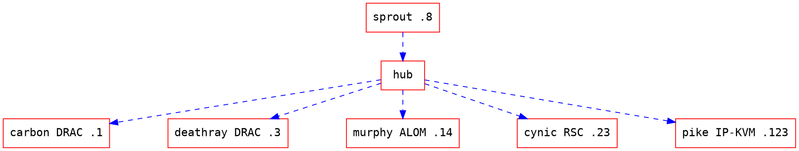

# DRAC access

## Overview

Our two poweredges have a DRAC, an embedded 'Dell Remote Access Controller' This allows us to:

* Perform remote reboots, shutdown, power up.
* View the actual VGA console, and even use it, but incredibly slowly.
* View all sorts of sensor information.

These embedded systems are running a few services like ftp, https, vnc, but
we're only interested in https, the others aren't really useful on their own
and should be ignored.

They are protected by ssl and a username/password, but since we don't want them
being fucked with, they're physically seperated from our other networks.

The only machine on our network that can access these is currently
sprout.redbrick.dcu.ie. T

The DRAC network is: 192.168.1.x - don't confuse this with our internal network,
192.168.0.x!

Note that carbon is on .2 because at some point there was a gateway on .1, or
crap.

## DRAC network diagram

To access the DRAC on either machine, you'll need to do some ssh port forwarding
via sprout.

Forward local port 443 to 192.168.1.3 via fap.

`ssh -L 443:192.168.1.3:443 username@b4.redbrick.dcu.ie`

Open [https://localhost](https://localhost:443/) in your browser and you should have the requested
machine's DRAC login page there. Eventually. They're slow fuckers. You can get
the login details from pwsafe.

## Quirks

You'll need a browser with a JRE to get anywhere. The remote console doesn't
appear to work with ssh forwarding, I think one may need to forward port 5900
(vnc) too, but not sure.

Ryaner - 5901 is where the vnc comes from. You'll need to forward that or remote
listen for it. I did both and it worked so.

-- phaxx - 28/04/05
